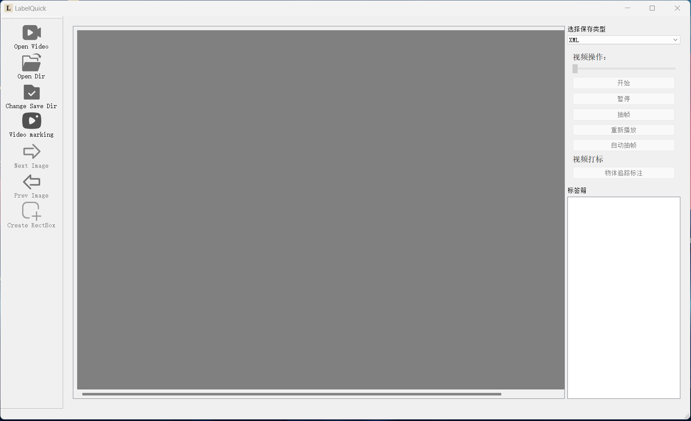
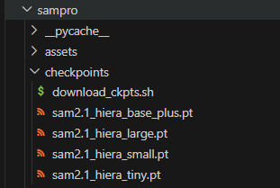
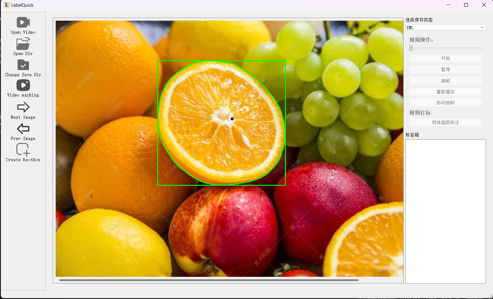
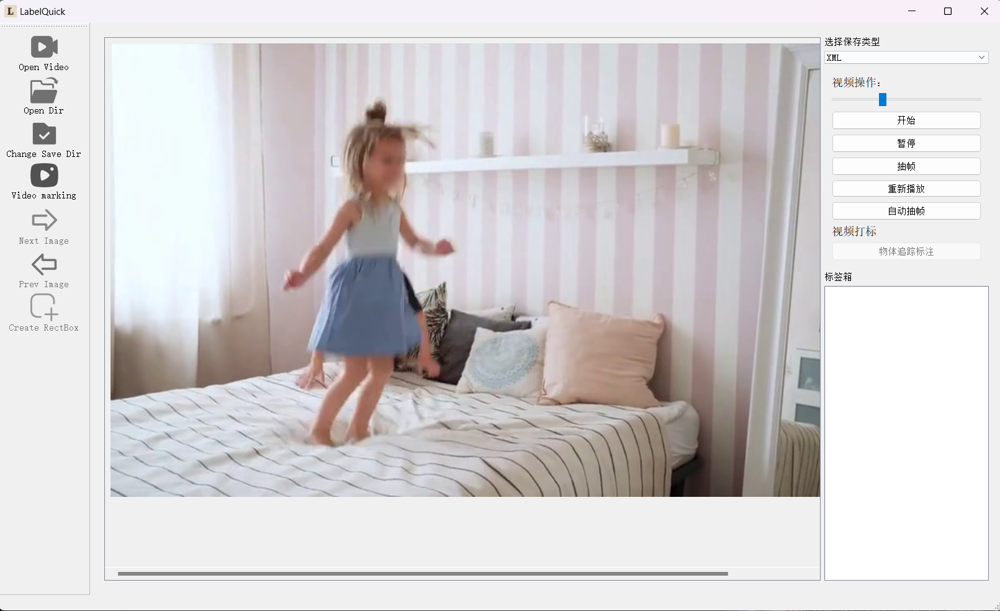

# LabelQuick
项目源地址：https://github.com/xaio6/LabelQuick
一种快速、轻松的AI辅助标注工具LabelQuick，基于开源项目LabelQuick进行了二次开发，添加了以下功能：
- 标签删除功能，标注错误可以对错误标签进行删除。
- 图片名称和数量显示功能，标注过程中方便查找目标图片。
- 标签选择功能，画完标注框直接双击标签，节省标注时间。
- 标签预加载功能，在LabelQuick\GUI\history.txt中可以预填写需要标注的标签。

<div> </div>

### 项目更新
🔥 V1.0 : 2024/7/8: 

- 我们更新了模型仓库的运行文件和配置文件，开源基础的UI跟标注功能，主要用于XML的数据标注。

🔥 V2.0 : 2025/1/20:
- 打标方式新增拉框标注，打标方式可切换。
- 新增模型仓库，模型仓库包含SAM2模型，用于快速标注。
- 支持视频物体追踪打标，选择物体后，自动追踪物体，并完成标注。
- 新增视频操作功能，包括开始播放，暂停，重新播放，抽帧操作。
- 优化了项目代码，修改了以知的BUG。


### 简介
LabelQuick_V2.0 是一款由 AI Horizon 团队设计并开发的快速图像标注工具，该版本在上一个版本的基础上进行了优化与改进。目前提供了直观易用的界面和强大的标注与分割功能，帮助您高效完成数据集的标注工作。当前版本仅支持 Windows 系统。

<div> </div>


### 快速开始
>⚠️显存最低需要`6G`⚠️
1. **拉取代码**
   ```bash
   git clone https://github.com/xaio6/LabelQuick
   ```

2. **模型下载**
下载[模型](https://pan.baidu.com/s/1dnfxBXaCYANRGcAxx7y0vg?pwd=ax58)到 `sampro/checkpoints` 里面。
-<div> </div>

3. **环境配置**
   ```bash
   # 虚拟环境创建
    conda create -n Anything python=3.10
    conda activate Anything

    # pytorch安装方式1（没有安装CUDA）：
    conda install cudatoolkit=11.8 -c https://mirrors.tuna.tsinghua.edu.cn/anaconda/pkgs/free/linux-64/

    conda install cudnn

    pip install torch==2.1.2 torchvision==0.16.2 torchaudio==2.1.2 --index-url https://download.pytorch.org/whl/cu118

    # pytorch安装方式2（已经有安装CUDA，版本为CUDA=11.8）：
    pip install torch==2.1.2 torchvision==0.16.2 torchaudio==2.1.2 --index-url https://download.pytorch.org/whl/cu118
    ```

    ```bash
    # 安装项目依赖
    pip install -r requirements.txt -i https://pypi.tuna.tsinghua.edu.cn/simple
    ```

4. **项目运行**

- 运行 `Run.py` 打开 LabelQuick。


### 用户界面介绍
<div> </div>

- **顶部菜单栏**：包含文件、编辑、视图等常用功能。
- **左侧工具栏**：打开文件夹、选择标注数据储存位置、视频物体追踪标注。
- **中央工作区**：展示您的数据集，供您进行标注。
- **右侧属性面板**：显示当前数据集的标签。
- **进度条：** 可查看视频的播放进度，支持任意拖动播放位置。
- **按钮功能：** 包括开始播放，暂停，重新播放，抽帧操作。
- **自动抽帧：** 视频每秒自动抽取两帧图片。


### 功能详解
<div> </div>

- **快速标注**：2.0 版本快速打标，只需鼠标左键单击标注对象，软件将自动识别物品最大边缘的最小矩形框并进行快速自动标注。
- **视频物体追踪**：选择物体后，自动追踪物体，并完成标注。
- **视频操作**：支持视频播放、暂停、重新播放、抽帧操作。
- **自动抽帧**：视频每秒自动抽取两帧图片。


### **技术优势：**
我们引入了最新的 sam2 模型，在自动检测打标过程中实现了更高的准确率和效率。该模型能够快速对视频帧中的目标进行精准识别，减少人工干预，提高标注的质量。

### Demo
- 自动抽帧：

https://github.com/user-attachments/assets/66fef93a-18bc-4c6e-a91e-d90d63c33d89

- 视频物体追踪：


https://github.com/user-attachments/assets/59a824f8-1d48-4e73-ba34-28dea14a3bcc


- 更具体的操作可以参考[哔哩哔哩](https://www.bilibili.com/video/BV1kufJYyEhu/?spm_id_from=333.1387.homepage.video_card.click&vd_source=d9c1011fcda5afa76e9f5504f72e577f)视频教程：

### 常见问题解答（FAQ）
- **Q:** 如何撤销错误的标注？  
  **A:** 使用快捷键 (Q 或 Delete 键)。
- **Q:** 有哪些快捷键？  
  **A:** 上一张：A；下一张：D；保存标注数据：S。
- **Q:** 如何切换标注模式？  
  **A:** 使用快捷键 (W键)。


### 友情链接
- [SegmentAnything](https://github.com/facebookresearch/segment-anything) :分割任何模型 （SAM）

- [SAM2](https://github.com/facebookresearch/sam2): SAM2:分割图像和视频中的任何内容

### 许可协议
本项目遵循 MIT Licence。在使用本工具时，请遵守相关法律，包括版权法、数据保护法和隐私法。未经原作者和/或版权所有者许可，请勿使用本工具。未经原作者和/或版权所有者许可，请勿使用本工具。此外，请确保遵守您参考的模型和组件中的所有许可协议。

### 技术支持和联系方式
如果您在使用过程中遇到任何问题，请联系我们的技术支持团队：
- 公众号：AI Horizon


感谢您选择 LabelQuick，我们希望这款工具能极大地提升您的工作效率。祝您标注愉快！
